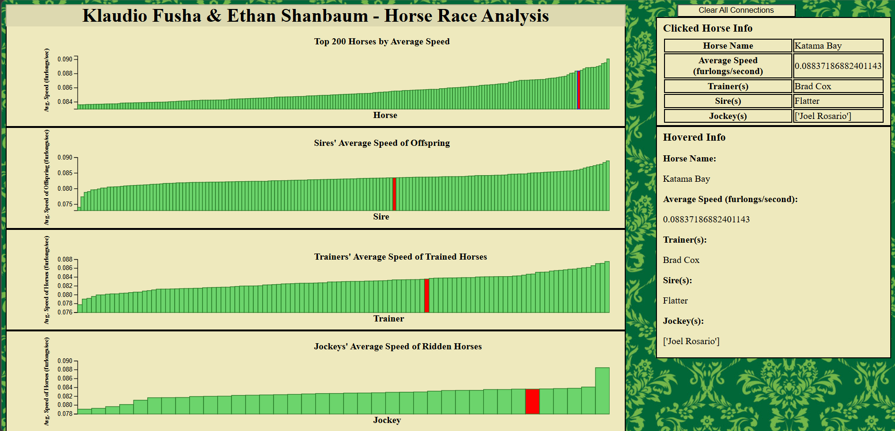

Final Project - Interactive Data Visualization  
===

# Group Members: Klaudio Fusha & Ethan Shanbaum

# Our Experiment:

The main goal and/or motivation of our project is to determine what conditions (jockey, trainer, sire, etc.) would produce the best racing horse. We think that having a detailed visualization that can properly communicate the optimal conditions would open new doors in either sports betting or recreational horse racing.

# Disclaimer:
This site was developed with the Chrome browser in mind. Correct sizing of charts is not guaranteed in other browsers. Additionally, we sized the heights of the charts with a screen resolution of 1920x1080 in mind. Chart formatting and sizing may be an issue with other screen sizes.

# Data Source(s):
- https://horseracingdatasets.com/racing/
- https://docs.google.com/spreadsheets/d/1ahggu4Z09OxpIEA7cDUxdiTuG5vsKhpzig3J8hrjwu8/edit?gid=0#gid=0

# Our Code:
- Core rendering logic:
    - index.html
    - allCharts.js
- Data exploration and preparation:
    - data_exploration.py
    - average_horse_speeds_data_prep.py
    - jockey_data_prep.py
    - sire_data_prep.py
    - trainer_data_prep.py

# Libraries:
- Rendering visualization:
    - D3js
- Data exploration and preparation:
    - Matplotlib
    - Pandas

# URLs:
- Project Website: https://thelegacy-coder.github.io/final/
- Recording Link: https://youtu.be/4lmHWP66mXg
- Project Book Link: [Link](https://github.com/TheLegacy-Coder/final/blob/69ae6ffbb517f65524d212c2d8f2e7a155353747/Klaudio%20Fusha%20%26%20Ethan%20Shanbaum%20-%20CS%204804%20-%20Proposal%20%26%20Process%20Book.pdf)

# Project References (VERIFY BEFORE SUBMITTING):
- https://www.publicdomainpictures.net/en/free-download.php?image=damask-pattern-background-green&id=44740 (background image)
- index.html:
    - https://www.w3schools.com/html/html_youtube.asp
- allCharts.js:
    - https://developer.mozilla.org/en-US/docs/Web/API/Screen/width
    - https://d3-graph-gallery.com/graph/barplot_basic.html
    - https://d3js.org/d3-axis#axis_ticks
    - https://d3-graph-gallery.com/graph/custom_axis.html#axistitles
    - https://d3-graph-gallery.com/graph/interactivity_tooltip.html
    - https://stackoverflow.com/questions/25123003/how-to-assign-click-event-to-every-svg-element-in-d3js
    - https://stackoverflow.com/questions/41402834/convert-string-array-to-array-in-javascript
- data_exploration.py:
    - https://www.statology.org/pandas-plot-value-counts/
    - https://stackoverflow.com/questions/32244019/how-to-rotate-x-axis-tick-labels-in-a-pandas-plot
    - https://stackoverflow.com/questions/8213522/when-to-use-cla-clf-or-close-for-clearing-a-plot
- average_horse_speeds_data_prep.py:
    - https://stackoverflow.com/questions/50938519/trying-to-change-a-single-value-in-pandas-dataframe
    - https://stackoverflow.com/questions/50938519/trying-to-change-a-single-value-in-pandas-dataframe
    - https://www.w3schools.com/python/ref_string_split.asp
    - https://www.doubledtrailers.com/length-in-horse-racing/
    - https://github.com/huggingface/datasets/issues/6778
    - https://stackoverflow.com/questions/34138634/pandas-groupby-how-to-get-top-n-values-based-on-a-column
- jockey_data_prep.py:
    - https://www.w3schools.com/python/ref_string_split.asp
    - https://www.doubledtrailers.com/length-in-horse-racing/
    - https://github.com/huggingface/datasets/issues/6778
    - https://stackoverflow.com/questions/34138634/pandas-groupby-how-to-get-top-n-values-based-on-a-column
- sire_data_prep.py:
    - https://stackoverflow.com/questions/50938519/trying-to-change-a-single-value-in-pandas-dataframe
    - https://stackoverflow.com/questions/50938519/trying-to-change-a-single-value-in-pandas-dataframe
    - https://www.w3schools.com/python/ref_string_split.asp
    - https://www.doubledtrailers.com/length-in-horse-racing/
    - https://github.com/huggingface/datasets/issues/6778
    - https://stackoverflow.com/questions/34138634/pandas-groupby-how-to-get-top-n-values-based-on-a-column
- trainer_data_prep.py:
    - https://www.doubledtrailers.com/length-in-horse-racing/
    - https://github.com/huggingface/datasets/issues/6778
    - https://stackoverflow.com/questions/34138634/pandas-groupby-how-to-get-top-n-values-based-on-a-column

Original Reference (Listed by Course Staff)
---

- This final project is adapted from https://www.dataviscourse.net/2020/project/
